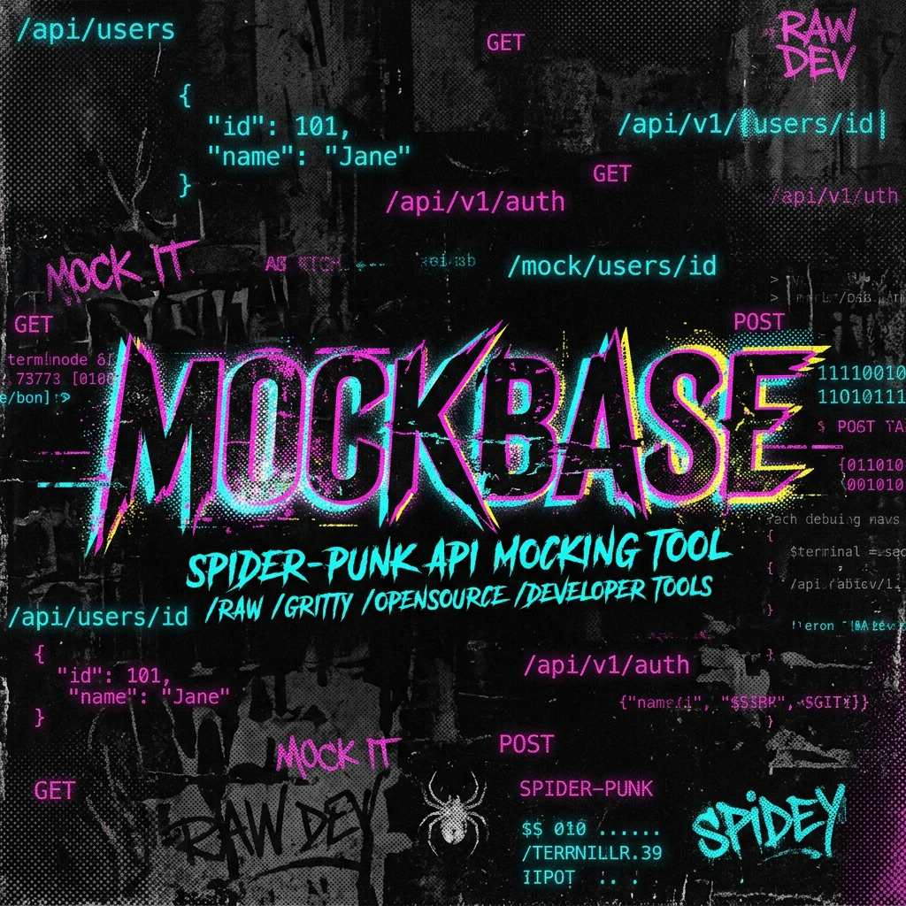

<p align="center">
  
</p>

<p align="center">
  <a href="https://mock-back.vercel.app/">
    
  </a>
</p>

<p align="center">
  
  
  
  
  
  
  
</p>

---

Describe an API in plain English → get a live, stateful mock server with auth, chaos engineering, and real-time logs. Under 5 seconds.

## How it works

1. You type something like *"A food delivery API with restaurants, menus, and orders"*
2. Groq (LLaMA-3) generates a full REST schema with typed fields
3. You tweak latency, error rates, auth, and rate limits with sliders
4. Hit deploy — you get a live URL you can `curl` immediately
5. Every request generates realistic fake data via Faker.js and persists state in Redis

## Architecture

```
┌─────────────────────────────────────────────────────────┐
│                    FRONTEND (Next.js)                    │
│              Vercel · mock-back.vercel.app               │
└───────────────────────┬─────────────────────────────────┘
                        │
                        ▼
┌─────────────────────────────────────────────────────────┐
│                  CORE API (NestJS)                       │
│                  Render · Docker                         │
│                                                         │
│  /auth/*          → JWT signup/login                    │
│  /mocks/*         → CRUD mock configs                  │
│  /mock/:id/*      → Dynamic mock traffic handler       │
│  /generate-schema → Proxy to LLM service               │
│                                                         │
│  ┌─────────────┐  ┌──────────────┐  ┌───────────────┐  │
│  │ Fault Inject │  │ Schema Faker │  │ SSE Log Stream│  │
│  │ latency/err  │  │ faker.js gen │  │ real-time logs│  │
│  └─────────────┘  └──────────────┘  └───────────────┘  │
└──────┬──────────────────┬───────────────────┬───────────┘
       │                  │                   │
       ▼                  ▼                   ▼
┌──────────────┐  ┌──────────────┐  ┌─────────────────┐
│  PostgreSQL  │  │    Redis     │  │  LLM Service    │
│  Neon        │  │  Upstash     │  │  FastAPI/Python  │
│              │  │              │  │  Render · Docker │
│  users       │  │  mock state  │  │                 │
│  mock configs│  │  rate limits │  │  LangChain +    │
│  request logs│  │  SSE pub/sub │  │  Groq (LLaMA-3) │
└──────────────┘  └──────────────┘  └─────────────────┘
```

## Features

| Feature | Description |
|---|---|
| **AI Schema Generation** | Describe your API in plain English. LLaMA-3 via Groq generates typed REST schemas in ~2 seconds. |
| **Stateful Mock Data** | `POST` creates a resource with Faker data and saves it to Redis. `GET` returns it. `DELETE` removes it. Like a real backend. |
| **Chaos Engineering** | Per-route latency injection (0–3000ms), jitter, configurable error rates (0–100%), and rate limiting. |
| **Auth Simulation** | Toggle protected routes. Auto-generated Bearer tokens. Requests without valid tokens get 401'd. |
| **Live Log Streaming** | Server-Sent Events push request logs to the dashboard in real-time. Method, path, status, latency — all visible. |
| **Edit on the Fly** | Change latency, error rates, or add new routes to a running mock without redeploying. Changes apply instantly via Redis. |

## Run locally

Prerequisites: **Docker Desktop**, **Node 20+**, **Python 3.11+**

```bash
# 1. Clone and configure
git clone https://github.com/MohitMadhu1/MockBack.git
cd MockBack
cp .env.example .env
# Fill in DATABASE_URL (Neon), REDIS_URL (Upstash), GROQ_API_KEY

# 2. Option A: Docker (all 3 services at once)
docker-compose up -d --build
# Open http://localhost:3001

# 3. Option B: Run services individually
# Terminal 1 — API
cd apps/api && npm install && npm run start:dev

# Terminal 2 — LLM
cd apps/llm-service && pip install -r requirements.txt && uvicorn main:app --reload --port 8000

# Terminal 3 — Frontend
cd apps/frontend && npm install && npm run dev
```

## Deployment

This runs on a **$0/month** stack:

| Service | Platform | Tier |
|---|---|---|
| Frontend | [Vercel](https://vercel.com) | Free |
| NestJS API | [Render](https://render.com) | Free (Docker) |
| FastAPI LLM | [Render](https://render.com) | Free (Docker) |
| PostgreSQL | [Neon](https://neon.tech) | Free |
| Redis | [Upstash](https://upstash.com) | Free |

## Project structure

```
MockBack/
├── apps/
│   ├── api/                 # NestJS backend
│   │   ├── src/
│   │   │   ├── auth/        # JWT auth (signup, login, guard)
│   │   │   ├── mocks/       # Mock CRUD + dynamic request handler
│   │   │   ├── faker/       # Schema-to-fake-data engine
│   │   │   ├── fault/       # Latency, error rate, rate limiting
│   │   │   └── logs/        # Request logging + SSE streaming
│   │   └── Dockerfile
│   ├── frontend/            # Next.js dashboard
│   │   ├── src/app/
│   │   │   ├── dashboard/   # Mock list + management
│   │   │   ├── mocks/       # Create, view, edit mocks
│   │   │   └── login/       # Auth pages
│   │   └── Dockerfile
│   └── llm-service/         # FastAPI + LangChain
│       ├── chain.py         # Groq LLM chain
│       ├── main.py          # API endpoint
│       └── Dockerfile
├── docker-compose.yml       # Full-stack orchestration
└── .env.example
```

---

<p align="center">
  <sub>Built with mass amounts of caffeine and mass amounts of punk rock.</sub>
</p>
